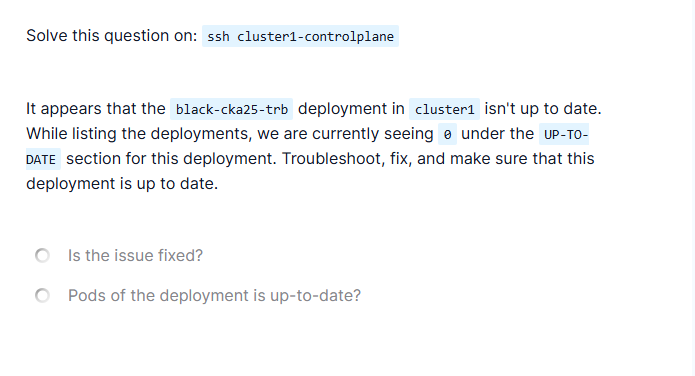

# CKA Troubleshooting – Deployment Showing UP-TO-DATE = 0 (Paused Deployment)

## Problem Statement

In `cluster1`, the deployment named `black-cka25-trb` is not up to date.

While listing deployments, the **UP-TO-DATE** column shows `0` for this deployment.

Tasks:
- Troubleshoot the issue.
- Fix the deployment.
- Ensure the deployment becomes up to date.



---

## Initial Observation

### Check deployment status
```bash
kubectl get deploy black-cka25-trb
```

Observed output (key fields):

```
READY   UP-TO-DATE   AVAILABLE
0/1     0            1
```

### Interpretation

* A pod is running (`AVAILABLE = 1`).
* No pod matches the **current deployment spec** (`UP-TO-DATE = 0`).
* Indicates rollout is blocked or not progressing.

---

## Investigation Steps

### Step 1: Describe the deployment

```bash
kubectl describe deploy black-cka25-trb
```

Key findings:

```text
Progressing    Unknown    DeploymentPaused
NewReplicaSet: <none>
```

### What this tells us

* The deployment is **paused**.
* Kubernetes will NOT:

  * Create a new ReplicaSet.
  * Update pods.
* Any spec changes will be recorded but **not applied**.

---

### Step 2: Compare Deployment vs ReplicaSet

#### Deployment image (desired state):

```text
Image: nginx:1.18
```

#### ReplicaSet / Pod image (current state):

```text
Image: nginx:1.14.2
```

### Interpretation

* Deployment spec was updated to `nginx:1.18`.
* Running pods are still using `nginx:1.14.2`.
* Because the deployment is paused, rollout never occurred.

---

## Root Cause

The deployment `black-cka25-trb` was **paused**, preventing Kubernetes from creating a new ReplicaSet and updating pods.

This directly caused:

* `UP-TO-DATE = 0`
* No new ReplicaSet
* Pods running an outdated image

---

## Fix (Rectification Steps)

### Resume the deployment

```bash
kubectl rollout resume deployment black-cka25-trb
```

No YAML edits were required.

---

## What Happens After the Fix

Once resumed, Kubernetes:

1. Creates a new ReplicaSet.
2. Uses the updated image (`nginx:1.18`).
3. Scales down the old ReplicaSet.
4. Updates the pod(s).

---

## Verification Steps

### 1. Verify deployment status

```bash
kubectl get deploy black-cka25-trb
```

Expected:

```
READY   UP-TO-DATE   AVAILABLE
1/1     1            1
```

---

### 2. Verify ReplicaSets

```bash
kubectl get rs
```

Expected:

* Old ReplicaSet scaled down.
* New ReplicaSet with updated pod running.

---

### 3. Verify pod image (optional)

```bash
kubectl describe pod <pod-name> | grep Image
```

Expected:

```
Image: nginx:1.18
```

---

## Final Outcome

* Deployment is no longer paused.
* Pods match the deployment specification.
* Deployment is fully up to date.

---

## Final Answers

* Is the issue fixed?
  ✅ Yes

* Are pods of the deployment up to date?
  ✅ Yes

---

## Key CKA Takeaways

* If `UP-TO-DATE = 0` **but pods are running**, always check:

  ```bash
  kubectl describe deploy <deployment-name>
  ```
* Look specifically for:

  ```
  DeploymentPaused
  ```
* A paused deployment silently blocks rollouts.

> **Paused deployments are one of the most common CKA troubleshooting traps.**

---

```

This Markdown now:
- ✅ Matches the **Purple Lab quality**.
- ✅ Contains **problem + solution**.
- ✅ Is revision-ready and exam-safe.
- ✅ Reflects exactly what **we fixed together**.

If you want, next we can:
- Consolidate **all your solved labs into one master CKA Troubleshooting Playbook**, or  
- Create **short “failure pattern” cards** (UP-TO-DATE = 0, Pending PVC, Empty Endpoints, etc.).
```
