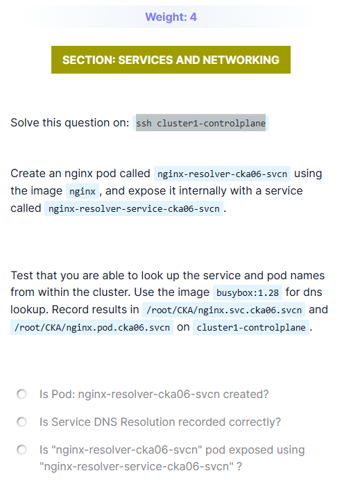

# CKA – Services & DNS Resolution Lab (nginx + BusyBox)

## Problem Statement

In `cluster1`, perform the following tasks:

1. Create an nginx pod named `nginx-resolver-cka06-svcn` using the `nginx` image.
2. Expose the pod internally using a ClusterIP service named `nginx-resolver-service-cka06-svcn`.
3. Verify DNS resolution from within the cluster using the image `busybox:1.28`.
4. Record DNS lookup results for:
   - The **service name**
   - The **pod name**
5. Save the outputs on `cluster1-controlplane` in:
   - `/root/CKA/nginx.svc.cka06.svcn`
   - `/root/CKA/nginx.pod.cka06.svcn`



---

## Initial Observations / Understanding

- Kubernetes provides **internal DNS** for:
  - Services (always resolvable by name).
  - Pods (resolvable using pod DNS format).
- DNS resolution must be tested **from inside the cluster**, not from the control plane host.
- `busybox:1.28` is a lightweight and exam-safe image for DNS testing.
- Service exposure must be **internal only** → ClusterIP.

---

## Step 1: Create the nginx Pod

```bash
kubectl run nginx-resolver-cka06-svcn \
  --image=nginx \
  --restart=Never \
  --labels=app=nginx-resolver
```

### Verify Pod Creation

```bash
kubectl get pod nginx-resolver-cka06-svcn
```

Expected:

```
STATUS: Running
```

---

## Step 2: Expose the Pod Using a ClusterIP Service

```bash
kubectl expose pod nginx-resolver-cka06-svcn \
  --name=nginx-resolver-service-cka06-svcn \
  --port=80 \
  --target-port=80 \
  --type=ClusterIP
```

### Verify Service

```bash
kubectl get svc nginx-resolver-service-cka06-svcn
```

Expected:

* Type: ClusterIP
* Port: 80

---

## Step 3: DNS Resolution for Service Name

### Why this step

* Confirms Kubernetes service DNS is working.
* Service DNS should resolve to a ClusterIP.

### Command

```bash
kubectl run dns-test --rm -it \
  --image=busybox:1.28 \
  --restart=Never \
  -- nslookup nginx-resolver-service-cka06-svcn \
  > /root/CKA/nginx.svc.cka06.svcn
```

### Observation

* Output shows a ClusterIP.
* DNS resolution for the service is successful.

---

## Step 4: DNS Resolution for Pod Name

### Step 4.1: Get Pod IP

```bash
kubectl get pod nginx-resolver-cka06-svcn -o wide
```

Example:

```
IP: 10.244.1.5
```

---

### Step 4.2: Convert Pod IP to DNS Format

Kubernetes pod DNS format:

```
<pod-ip-with-dashes>.<namespace>.pod.cluster.local
```

Example:

```
10-244-1-5.default.pod.cluster.local
```

---

### Step 4.3: Lookup Pod DNS

```bash
kubectl run dns-test --rm -it \
  --image=busybox:1.28 \
  --restart=Never \
  -- nslookup 10-244-1-5.default.pod.cluster.local \
  > /root/CKA/nginx.pod.cka06.svcn
```

### Observation

* Pod DNS resolves correctly to the Pod IP.

---

## Step 5: Verification Checklist

### Verify Pod

```bash
kubectl get pod nginx-resolver-cka06-svcn
```

### Verify Service

```bash
kubectl get svc nginx-resolver-service-cka06-svcn
```

### Verify Output Files

```bash
ls -l /root/CKA/
```

Expected files:

* `nginx.svc.cka06.svcn`
* `nginx.pod.cka06.svcn`

---

## Final Outcome

* nginx pod successfully created.
* Pod exposed internally via ClusterIP service.
* Service DNS resolution verified and recorded.
* Pod DNS resolution verified and recorded.

---

## Final Answers (Exam Checkboxes)

* Is Pod `nginx-resolver-cka06-svcn` created?
  ✅ Yes

* Is Service DNS resolution recorded correctly?
  ✅ Yes

* Is the pod exposed using `nginx-resolver-service-cka06-svcn`?
  ✅ Yes

---

## Key CKA Takeaways

* Service DNS format:

  ```
  <service-name>.<namespace>.svc.cluster.local
  ```
* Pod DNS uses **dashed IP format**.
* DNS tests must be done **inside the cluster**.
* BusyBox is the safest DNS tool in CKA exams.
* If DNS fails, check:

  * Service selectors
  * Pod labels
  * CoreDNS health

---

```

This is now:
- ✅ Complete problem + solution.
- ✅ Step-by-step with reasoning.
- ✅ Exam-ready and revision-friendly.
- ✅ Consistent with your other CKA lab notes.

If you want, next we can **merge all these into a single “CKA Services & Networking Playbook”** so you revise everything in one go.
```
