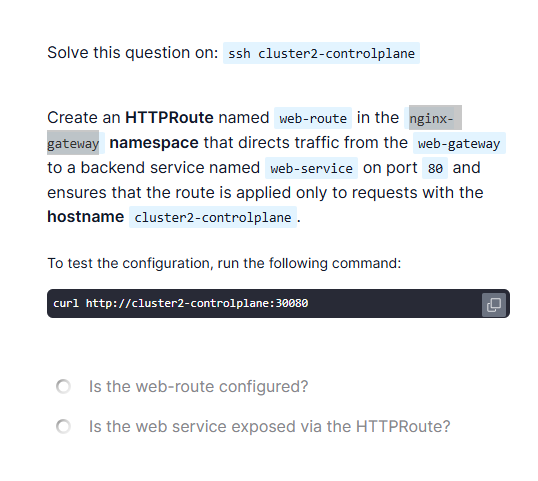

# CKA Services & Networking – Gateway API HTTPRoute Troubleshooting

## Problem Statement

On `cluster2`, perform the following tasks:

- Create an `HTTPRoute` named `web-route` in the `nginx-gateway` namespace.
- The route should:
  - Attach to the Gateway named `web-gateway`.
  - Forward traffic to a backend service named `web-service` on port `80`.
  - Apply routing **only** for requests with the hostname `cluster2-controlplane`.

### Validation Command
```bash
curl http://cluster2-controlplane:30080
```



---

## Initial Observation

* Gateway (`web-gateway`) is already running and exposed via NodePort.
* Backend service (`web-service`) exists and listens on port 80.
* Initial `curl` request fails or returns no response.
* No obvious errors are shown when listing resources.

This indicates:

* Infrastructure exists.
* Issue is likely with **HTTPRoute configuration**, not with pods or services.

---

## Investigation Steps

### Step 1: Check Existing HTTPRoute

```bash
kubectl get httproute -n nginx-gateway
kubectl describe httproute web-route -n nginx-gateway
```

Observed configuration (problematic):

```yaml
hostnames:
- "www.example.com"
```

---

## Root Cause

### ❌ Incorrect Hostname in HTTPRoute

* The HTTPRoute was configured with:

  ```
  hostnames: ["www.example.com"]
  ```
* But the test request uses:

  ```
  Host: cluster2-controlplane
  ```

### Why this breaks routing

* Gateway API routing is **hostname-sensitive**.
* If the `Host` header does not match the `hostnames` field:

  * The route is ignored.
  * Traffic never reaches the backend service.
* Gateway does **not** return a clear error — it fails silently.

---

## Fix (Rectification Steps)

### Step 1: Edit the HTTPRoute

```bash
kubectl edit httproute web-route -n nginx-gateway
```

### Step 2: Correct the hostname

Replace:

```yaml
hostnames:
- "www.example.com"
```

With:

```yaml
hostnames:
- "cluster2-controlplane"
```

### Correct Final HTTPRoute Configuration

```yaml
apiVersion: gateway.networking.k8s.io/v1
kind: HTTPRoute
metadata:
  name: web-route
  namespace: nginx-gateway
spec:
  parentRefs:
  - name: web-gateway
  hostnames:
  - "cluster2-controlplane"
  rules:
  - matches:
    - path:
        type: PathPrefix
        value: /
    backendRefs:
    - name: web-service
      port: 80
```

Save and exit.

---

## Verification Steps

### 1. Verify HTTPRoute Status

```bash
kubectl get httproute web-route -n nginx-gateway
```

Expected:

* Route is **Accepted**.
* No rejected conditions.

---

### 2. Test Access via Gateway

```bash
curl http://cluster2-controlplane:30080
```

Expected:

* Successful HTTP response from `web-service`.

---

## Final Outcome

* HTTPRoute correctly attached to `web-gateway`.
* Traffic routed to `web-service` on port 80.
* Routing works **only** when hostname matches `cluster2-controlplane`.

---

## Final Answers (Exam Checkboxes)

* Is the web-route configured?
  ✅ Yes

* Is the web service exposed via the HTTPRoute?
  ✅ Yes

---

## Key CKA Takeaways (Important)

* HTTPRoute routing is **strictly dependent on hostname matching**.
* A wrong hostname (e.g., `example.com`) will cause **silent routing failure**.
* Always align:

  * `curl` Host header
  * Gateway listener hostname
  * HTTPRoute `hostnames`
* If Gateway + Service exist but traffic fails:

  * Check **HTTPRoute hostnames first**.

> **In Gateway API, wrong hostname ≠ partial success — it means no routing at all.**

---

```

This markdown now:
- ✅ Matches your **Purple + DNS lab format**.
- ✅ Clearly highlights the **hostname mistake**.
- ✅ Contains **problem + solution + reasoning**.
- ✅ Is ideal for **last-week CKA revision**.

If you want next:
- I can merge **all Gateway + Service + DNS + Troubleshooting labs** into a **single master playbook**, or  
- Create a **“silent failure patterns” cheat sheet** (Paused Deployments, Empty Endpoints, Wrong Hostnames, etc.).
```
