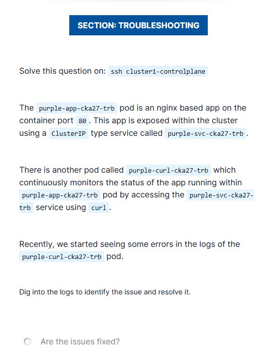

# CKA Troubleshooting Lab – Purple App Service Connectivity Issue

## Lab Context / Question

- Pod: `purple-app-cka27-trb`
  - nginx-based application.
  - Listens on **container port 80**.
- Service: `purple-svc-cka27-trb`
  - Type: `ClusterIP`.
  - Used to expose the nginx app internally.
- Pod: `purple-curl-cka27-trb`
  - Continuously monitors the nginx app using `curl`
  - Accesses the app via the service name.

### Problem Statement

Recently, errors started appearing in the logs of the `purple-curl-cka27-trb` pod.  
Investigate the logs, identify the issue, and fix it so the application becomes reachable again.



---

## Initial Observation

### 1. Check curl pod logs
```bash
kubectl logs purple-curl-cka27-trb | tail -10
```

Observed output:

```text
Not able to connect to the nginx app on http://purple-svc-cka27-trb
Terminated
```

### Interpretation

* DNS resolution works (service name is reachable).
* The failure is **not DNS-related**.
* The issue lies between:

  * Service → Pod communication.

---

## Investigation Steps (What We Checked and Why)

### Step 1: Verify Application Pod Health

```bash
kubectl get pod purple-app-cka27-trb -o wide
```

Observed:

* Pod is `Running`.
* Pod IP assigned.

Test nginx directly using Pod IP:

```bash
curl http://<POD-IP>:80
```

Result:

* nginx welcome page returned.

✅ **Conclusion**:
The application pod is healthy and nginx is listening correctly on port 80.

---

### Step 2: Inspect Service Configuration

```bash
kubectl get svc purple-svc-cka27-trb
```

Observed:

```text
PORT(S): 8080/TCP
```

Service details:

* Type: ClusterIP
* Exposed Port: **8080**

---

### Step 3: Compare with Pod Configuration

From the pod definition:

* nginx listens on **container port 80**.

At this point, we have:

| Component   | Port |
| ----------- | ---- |
| Pod (nginx) | 80   |
| Service     | 8080 |

❌ **Mismatch detected**

---

## Root Cause

The Service `purple-svc-cka27-trb` was forwarding traffic to **port 8080**, but the nginx container inside the pod was listening on **port 80**.

As a result:

* Service traffic was sent to a port where nothing was listening.
* curl pod could not connect to the application.

---

## Fix (Rectification Steps)

### Step 1: Edit the Service

```bash
kubectl edit svc purple-svc-cka27-trb
```

### Step 2: Correct the ports configuration

```yaml
ports:
- port: 80
  targetPort: 80
```

Explanation:

* `port`: Service port (clients use this).
* `targetPort`: Must match the container’s listening port.

Save and exit.

---

## Verification Steps (Mandatory in Exam)

### 1. Verify Service Port

```bash
kubectl get svc purple-svc-cka27-trb
```

Expected:

```text
80/TCP
```

---

### 2. Verify Endpoints

```bash
kubectl get endpoints purple-svc-cka27-trb
```

Expected:

```text
<POD-IP>:80
```

This confirms:

* Service selector is correct.
* Traffic will be routed to the pod on the correct port.

---

### 3. Verify curl pod logs

```bash
kubectl logs purple-curl-cka27-trb | tail -5
```

Expected:

* No connection error messages.
* Successful HTTP responses.

Optional manual check:

```bash
kubectl exec -it purple-curl-cka27-trb -- curl purple-svc-cka27-trb
```

---

## Final Outcome

* Application pod is reachable via the ClusterIP service.
* curl pod successfully monitors the application.
* Issue fully resolved.

---

## Key CKA Takeaways

* If **Pod IP works but Service fails**, always check:

  * `targetPort` vs `containerPort`.
* ClusterIP issues are most often caused by:

  * Port mismatch.
  * Selector mismatch.
* Always validate with:

  ```bash
  kubectl get endpoints <service-name>
  ```

> **Service `targetPort` must match the port the container is actually listening on.**
- ✅ Root cause (clearly stated).
- ✅ Fix (exact commands).
- ✅ Verification (exam-grade).
- ✅ Takeaways (memory anchors).

If you want, next we can:
- Compress this into a **1-page rapid revision sheet**, or  
- Build a **CKA Troubleshooting Playbook** combining all labs you’ve solved so far.
```
