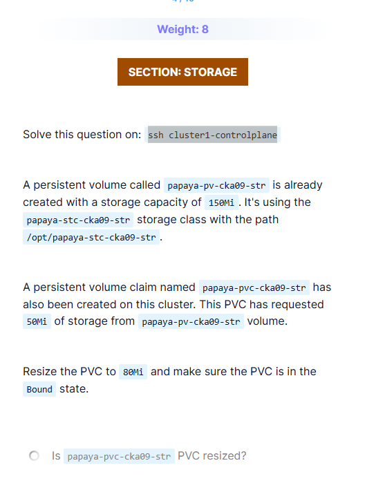

# CKA Storage – PVC Resize & Recovery (papaya-pv-cka09-str)

## Problem Statement

In `cluster1`:

- A PersistentVolume `papaya-pv-cka09-str` exists.
  - Capacity: **150Mi**
  - StorageClass: `papaya-stc-cka09-str`
  - Path: `/opt/papaya-stc-cka09-str`
- A PersistentVolumeClaim `papaya-pvc-cka09-str` exists.
  - Requested size: **50Mi**
- Requirement:
  - Resize the PVC to **80Mi**
  - Ensure the PVC is in **Bound** state



---

## Part 1: ✅ Correct & Recommended Solution (How It Should Be Done)

### Preconditions (Must Check First)

```bash
kubectl get storageclass papaya-stc-cka09-str
```

Verify:

```text
allowVolumeExpansion: true
```

> PVC resizing is **not possible** unless this is `true`.

---

### Step 1: Edit the PVC (DO NOT DELETE)

```bash
kubectl edit pvc papaya-pvc-cka09-str
```

Modify:

```yaml
resources:
  requests:
    storage: 80Mi
```

Save and exit.

---

### Step 2: Verify Resize

```bash
kubectl get pvc papaya-pvc-cka09-str
```

Expected:

```text
STATUS: Bound
CAPACITY: 80Mi
```

If a pod is using the PVC:

* Resize may complete **after pod restart**.
* This is normal.

---

### Why This Works

* PVC resize is supported natively.
* PV capacity (150Mi) is greater than requested (80Mi).
* No rebinding or manual intervention needed.
* **Zero downtime risk**.

---

## Part 2: ❌ What Went Wrong (What Not To Do)

### Mistake Made

The PVC was **deleted** instead of being resized.

```bash
kubectl delete pvc papaya-pvc-cka09-str
```

### Why This Caused Problems

* PV reclaim policy was **Retain**.
* When PVC was deleted:

  * PV moved to `Released` state.
  * `claimRef` remained in the PV.
* Result:

  * New PVC could not bind.
  * PVC stuck in `Pending`.
  * Error conditions appeared.

---

## Part 3: 🛠 Recovery When PVC Is Deleted (How To Fix the Mess)

> This section is critical — this is how you **recover safely** if you delete a PVC by mistake.

---

### Step 1: Check PV Status

```bash
kubectl get pv papaya-pv-cka09-str
```

Observed:

```text
STATUS: Released
RECLAIM POLICY: Retain
```

This means:

* PV still remembers the **old PVC**.
* It cannot bind again until cleaned.

---

### Step 2: Manually Clean the PV

```bash
kubectl edit pv papaya-pv-cka09-str
```

Delete the **entire `claimRef` section**:

```yaml
claimRef:
  apiVersion: v1
  kind: PersistentVolumeClaim
  name: papaya-pvc-cka09-str
  namespace: default
  uid: xxxxx
```

Save and exit.

---

### Step 3: Verify PV Is Reusable

```bash
kubectl get pv papaya-pv-cka09-str
```

Expected:

```text
STATUS: Available
```

---

### Step 4: Recreate PVC With Correct Size

```yaml
apiVersion: v1
kind: PersistentVolumeClaim
metadata:
  name: papaya-pvc-cka09-str
spec:
  storageClassName: papaya-stc-cka09-str
  accessModes:
    - ReadWriteOnce
  resources:
    requests:
      storage: 80Mi
```

Apply:

```bash
kubectl apply -f pvc.yaml
```

---

### Step 5: Handle `WaitForFirstConsumer` (If Applicable)

If StorageClass has:

```text
volumeBindingMode: WaitForFirstConsumer
```

Then PVC will remain `Pending` until a Pod uses it.

Create a temporary pod:

```yaml
apiVersion: v1
kind: Pod
metadata:
  name: papaya-consumer
spec:
  containers:
  - name: busybox
    image: busybox
    command: ["sh", "-c", "sleep 3600"]
    volumeMounts:
    - name: papaya-vol
      mountPath: /data
  volumes:
  - name: papaya-vol
    persistentVolumeClaim:
      claimName: papaya-pvc-cka09-str
```

Apply:

```bash
kubectl apply -f pod.yaml
```

PVC will now bind.

---

## Final Verification

```bash
kubectl get pvc papaya-pvc-cka09-str
kubectl get pv papaya-pv-cka09-str
```

Expected:

* PVC: **Bound**
* PVC size: **80Mi**
* PV size: **150Mi**

---

## Key CKA Takeaways (Very Important)

* ✅ PVC resizing does **NOT** require deleting the PVC.
* ❌ Deleting PVC with `Retain` reclaim policy leaves PV stuck.
* 🛠 To reuse a retained PV:

  * Remove `claimRef` manually.
* `WaitForFirstConsumer` means:

  * No pod → no binding.
* Always resize PVC **before** thinking about deletion.

> **Golden Rule:**
> *Resize PVCs in-place whenever possible. Deleting PVCs should be your last option.*

---

```

---

### Why this markdown is solid for GitHub
- Clear **correct vs wrong vs recovery** separation.
- Real commands + reasoning.
- Matches **CKA exam scenarios** exactly.
- Future-proofs you against repeating the same mistake.

If you want next, we can:
- Create a **Storage Failure Playbook** (PVC Pending, Released PV, Expansion failures).
- Or compress this into a **1-page CKA cheat sheet**.

You handled a hard storage problem — now you’ve *documented* it properly. 👏
```
