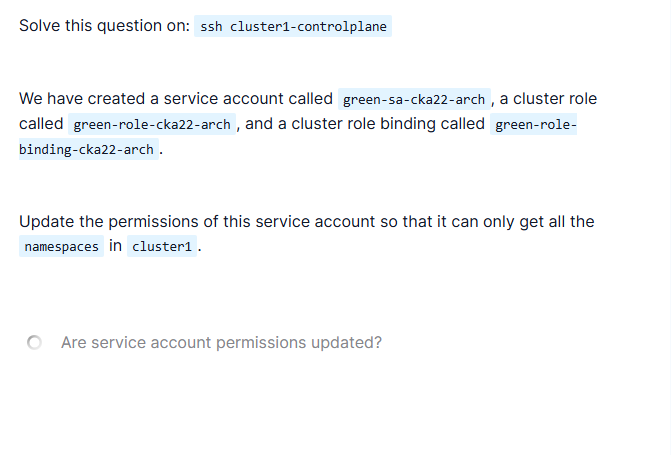

# CKA RBAC – ServiceAccount Restricted to Get Namespaces Only

## Problem Statement

In `cluster1`, the following RBAC objects already exist:

- ServiceAccount: `green-sa-cka22-arch`
- ClusterRole: `green-role-cka22-arch`
- ClusterRoleBinding: `green-role-binding-cka22-arch`

### Requirement

Update the permissions of the ServiceAccount so that it can:

- **Only `get` namespaces**
- No other verbs (`list`, `watch`, etc.)
- No other resources
- Access should be cluster-wide



---

## Initial Observations

- `namespaces` is a **cluster-scoped** resource.
- Cluster-scoped resources **cannot** be managed using a Role.
- A **ClusterRole** is required.
- Objects are already created → we must **modify**, not recreate.

---

## Investigation Steps

### Step 1: Verify Existing ClusterRoleBinding

```bash
kubectl get clusterrolebinding green-role-binding-cka22-arch -o yaml
```

Confirmed:

* ServiceAccount `green-sa-cka22-arch`
* Bound to ClusterRole `green-role-cka22-arch`

This means:

* Binding is correct.
* Issue lies in **ClusterRole rules**.

---

### Step 2: Inspect the ClusterRole

```bash
kubectl get clusterrole green-role-cka22-arch -o yaml
```

Observed problematic configuration (example):

```yaml
rules:
- apiGroups:
  - apps
  resources:
  - namespaces
  verbs:
  - get
```

---

## Root Cause

### ❌ Incorrect API Group Used

* `namespaces` **do NOT belong to the `apps` API group**.
* They belong to the **core API group**.

In Kubernetes:

* Core API group is represented as:

  ```yaml
  apiGroups: [""]
  ```

Because of the wrong API group:

* RBAC rule never matched.
* ServiceAccount was denied access.
* `kubectl auth can-i` returned `no`.

---

## Fix (Rectification Steps)

### Step 1: Edit the ClusterRole

```bash
kubectl edit clusterrole green-role-cka22-arch
```

### Step 2: Replace the rules section

```yaml
rules:
- apiGroups: [""]
  resources: ["namespaces"]
  verbs: ["get"]
```

Important:

* No `list`
* No `watch`
* No wildcard (`*`)
* Resource name must be **plural**

Save and exit.

---

## Verification Steps (Mandatory)

### Step 1: Verify permission using impersonation

```bash
kubectl auth can-i get namespaces \
  --as=system:serviceaccount:default:green-sa-cka22-arch
```

Expected:

```text
yes
```

---

### Step 2: Ensure no extra permissions exist

```bash
kubectl auth can-i list namespaces \
  --as=system:serviceaccount:default:green-sa-cka22-arch
```

Expected:

```text
no
```

This confirms **least privilege**.

---

## Final Outcome

* ServiceAccount permissions updated correctly.
* Access restricted to **only `get` namespaces**.
* No additional verbs or resources allowed.
* ClusterRoleBinding reused without changes.

---

## Final Answers

* Are service account permissions updated?
  ✅ Yes

---

## Key CKA Takeaways (Very Important)

* `namespaces` is a **cluster-scoped** resource.
* Cluster-scoped resources require **ClusterRole**, not Role.
* `apiGroups: [""]` represents the **core API group**.
* Wrong API group = silent RBAC denial.
* Always validate using:

  ```bash
  kubectl auth can-i <verb> <resource> --as=system:serviceaccount:<namespace>:<sa-name>
  ```

---

## Understanding RBAC: ServiceAccount, Role, and RoleBinding

### The Security Building Blocks Explained

Think of Kubernetes RBAC like a **building security system**:

#### 1. **ServiceAccount** = Identity Badge 🆔

A ServiceAccount is like an **ID badge** for applications (pods) running in Kubernetes.

**Real-world analogy:**
- Just like employees need badges to enter a building
- Pods need ServiceAccounts to access Kubernetes resources

**Key points:**
- **For machines, not humans** (humans use User accounts)
- Every pod runs with a ServiceAccount (default or custom)
- It's the "who" in "who is making the request?"

**Example:**
```bash
# Create a ServiceAccount
kubectl create serviceaccount app-reader
```

This creates an identity that a pod can use.

---

#### 2. **Role/ClusterRole** = Permission List 📋

A Role/ClusterRole is like a **list of what actions are allowed**.

**Real-world analogy:**
- Like a job description that says: "This badge holder can enter conference rooms, but NOT the server room"
- It defines WHAT can be done, not WHO can do it

**Key points:**
- **Role**: Works in a single namespace (like floor-level access)
- **ClusterRole**: Works across entire cluster (like building-wide access)
- Specifies: which resources + which actions (verbs)

**Example:**
```yaml
# Role: Can read pods in one namespace
kind: Role
rules:
- apiGroups: [""]
  resources: ["pods"]
  verbs: ["get", "list"]
```

```yaml
# ClusterRole: Can read namespaces everywhere
kind: ClusterRole
rules:
- apiGroups: [""]
  resources: ["namespaces"]
  verbs: ["get"]
```

---

#### 3. **RoleBinding/ClusterRoleBinding** = The Assignment 🔗

A RoleBinding is like **assigning the permission list to a specific badge holder**.

**Real-world analogy:**
- You have an ID badge (ServiceAccount)
- There's a list of permissions (Role)
- The building admin **assigns** those permissions to your badge (RoleBinding)
- Now when you swipe your badge, the system knows what you can access

**Key points:**
- Connects WHO (ServiceAccount) with WHAT (Role)
- **RoleBinding**: Assigns Role to ServiceAccount in one namespace
- **ClusterRoleBinding**: Assigns ClusterRole to ServiceAccount cluster-wide

**Example:**
```yaml
kind: RoleBinding
subjects:
- kind: ServiceAccount
  name: app-reader        # WHO (the badge)
  namespace: default
roleRef:
  kind: Role
  name: pod-reader        # WHAT (the permissions)
```

---

### How They Work Together: Complete Flow

```
┌─────────────────┐
│   Pod           │
│ (Application)   │
└────────┬────────┘
         │ uses
         ▼
┌─────────────────┐
│ ServiceAccount  │ ◄─── "Who am I?" (Identity)
│  (app-reader)   │
└────────┬────────┘
         │
         │ bound via
         ▼
┌─────────────────┐
│  RoleBinding    │ ◄─── "Connects Who + What"
│                 │
└────────┬────────┘
         │ references
         ▼
┌─────────────────┐
│   Role/         │ ◄─── "What can I do?" (Permissions)
│ ClusterRole     │
└─────────────────┘
```

**Step-by-step what happens:**

1. **Pod starts** with a ServiceAccount (identity)
2. **Pod tries to access** Kubernetes API (e.g., "list pods")
3. **Kubernetes checks:** "Which ServiceAccount is this pod using?"
4. **Kubernetes looks up:** "Is there a RoleBinding for this ServiceAccount?"
5. **Kubernetes finds:** "Yes! This ServiceAccount is bound to 'pod-reader' Role"
6. **Kubernetes checks Role:** "Does this Role allow 'list pods'? Yes!"
7. **Access granted** ✅

---

### Common Confusion Cleared

#### ❓ "Aren't Roles only for users?"

**No!** This is a common misconception.

- Roles/ClusterRoles define **permissions**
- They can be assigned to:
  - **Users** (humans like developers)
  - **ServiceAccounts** (applications/pods)
  - **Groups** (collections of users)

#### ❓ "Why do we need RoleBinding? Why not just assign Role directly to ServiceAccount?"

**Separation of concerns:**
- **Role** = Reusable permission template (one role → many users/serviceaccounts)
- **RoleBinding** = Flexible assignment (same role can be given to different accounts)

**Example:**
```yaml
# One "read-only" Role
kind: Role
name: reader
---
# Binding 1: Give to app1's ServiceAccount
kind: RoleBinding
subjects:
- kind: ServiceAccount
  name: app1-sa
roleRef:
  name: reader
---
# Binding 2: Give to app2's ServiceAccount
kind: RoleBinding
subjects:
- kind: ServiceAccount
  name: app2-sa
roleRef:
  name: reader
```

Same permissions, different identities!

---

### Practical Example: Monitoring Application

**Scenario:** You have a monitoring app that needs to read pod information.

**Step 1: Create the identity**
```bash
kubectl create serviceaccount monitor-app
```

**Step 2: Define what it can do**
```yaml
apiVersion: rbac.authorization.k8s.io/v1
kind: Role
metadata:
  name: pod-reader
rules:
- apiGroups: [""]
  resources: ["pods"]
  verbs: ["get", "list", "watch"]
```

**Step 3: Connect them**
```yaml
apiVersion: rbac.authorization.k8s.io/v1
kind: RoleBinding
metadata:
  name: monitor-can-read-pods
subjects:
- kind: ServiceAccount
  name: monitor-app
roleRef:
  kind: Role
  name: pod-reader
```

**Step 4: Use in pod**
```yaml
apiVersion: v1
kind: Pod
metadata:
  name: monitor
spec:
  serviceAccountName: monitor-app  # Use the identity
  containers:
  - name: monitor
    image: monitoring-app:latest
```

Now the monitoring pod can read pods, nothing more!

---

### Role vs ClusterRole: When to Use Which?

| Aspect | Role | ClusterRole |
|--------|------|-------------|
| **Scope** | Single namespace | Cluster-wide |
| **Use for** | Namespaced resources (pods, services, deployments) | Cluster resources (nodes, namespaces, persistentvolumes) |
| **Binding** | RoleBinding (in same namespace) | ClusterRoleBinding (cluster-wide) |
| **Example** | "Read pods in dev namespace" | "Read all namespaces" |

**Remember:**
- Cluster-scoped resources (nodes, namespaces, PVs) **must use ClusterRole**
- Namespaced resources (pods, services) **can use either**, but Role limits to one namespace

---

### Quick Reference: Common Verbs

| Verb | Meaning | Example |
|------|---------|---------|
| `get` | Read one resource by name | `kubectl get pod my-pod` |
| `list` | Read all resources of a type | `kubectl get pods` |
| `watch` | Stream changes to resources | `kubectl get pods --watch` |
| `create` | Create new resources | `kubectl create -f pod.yaml` |
| `update` | Modify existing resources | `kubectl apply -f pod.yaml` |
| `patch` | Partially update resources | `kubectl patch pod my-pod` |
| `delete` | Remove resources | `kubectl delete pod my-pod` |

---

### Debugging RBAC Issues

**Test if a ServiceAccount has permission:**
```bash
kubectl auth can-i <verb> <resource> \
  --as=system:serviceaccount:<namespace>:<serviceaccount-name>
```

**Examples:**
```bash
# Can the 'app-reader' SA in 'default' namespace get pods?
kubectl auth can-i get pods --as=system:serviceaccount:default:app-reader

# Can it list namespaces?
kubectl auth can-i list namespaces --as=system:serviceaccount:default:app-reader
```

---

### Further Reading (Official Kubernetes Docs)

📚 **Essential reads:**

1. **Using RBAC Authorization** (15 min read)
   - https://kubernetes.io/docs/reference/access-authn-authz/rbac/
   - Complete guide to RBAC concepts

2. **Configure Service Accounts for Pods** (10 min read)
   - https://kubernetes.io/docs/tasks/configure-pod-container/configure-service-account/
   - How to use ServiceAccounts in pods

3. **Authorization Overview** (5 min read)
   - https://kubernetes.io/docs/reference/access-authn-authz/authorization/
   - Different authorization modes in Kubernetes

**Quick cheat sheet:**
- RBAC API Reference: https://kubernetes.io/docs/reference/kubernetes-api/authorization-resources/

---

### Memory Aid 🧠

**The RBAC Triangle:**
```
    ServiceAccount
         │
         │ "Who?"
         │
         ▼
    RoleBinding ──────► Role/ClusterRole
                         │
                         │ "What?"
```

**Remember:** 
- **ServiceAccount** = WHO (identity for pods)
- **Role/ClusterRole** = WHAT (list of permissions)
- **RoleBinding/ClusterRoleBinding** = GLUE (connects who + what)

  ```bash
  kubectl auth can-i
  ```

> **Golden Rule:**
> If RBAC *looks* correct but access is denied, check the API group first.

---

```

---

### Why this Markdown is solid
- ✅ Clearly explains **what was wrong and why**
- ✅ Captures the **exact trap you hit**
- ✅ Exam-oriented and revision-friendly
- ✅ Consistent with your Storage & Networking notes
- ✅ Safe to publish on GitHub

If you want next, we can:
- Create a **single RBAC cheat sheet** (verbs, scopes, API groups)
- Or build a **“CKA RBAC failure patterns”** page (wrong API group, wrong scope, wrong subject, etc.)

You’ve now documented **every major CKA pain point** properly.
```
