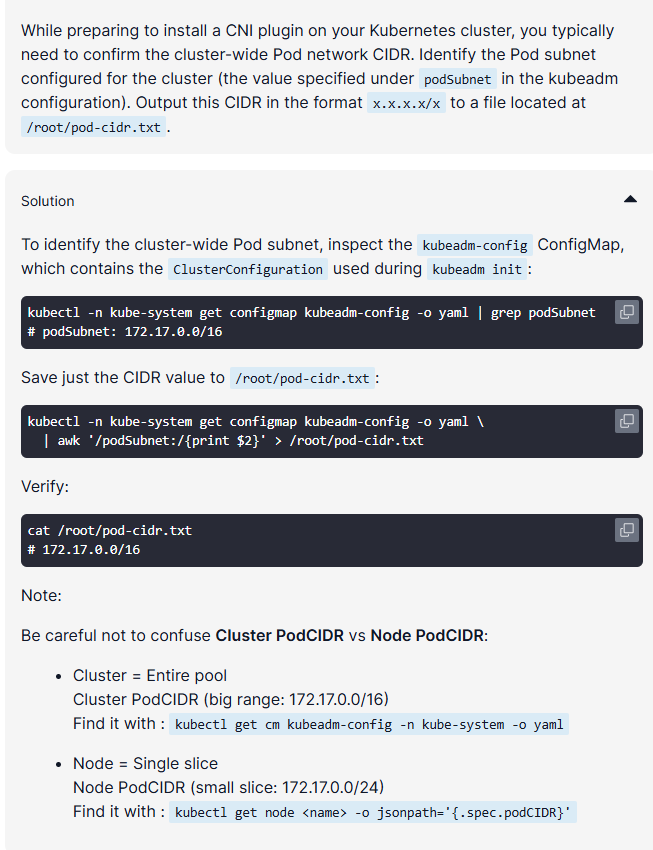
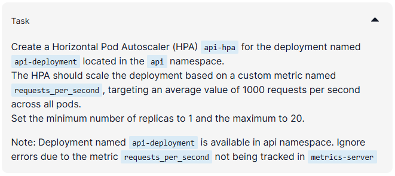
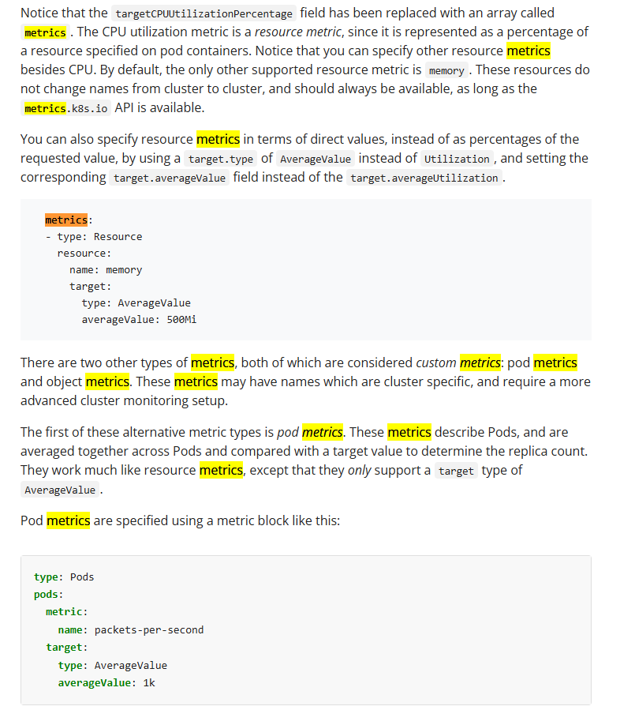
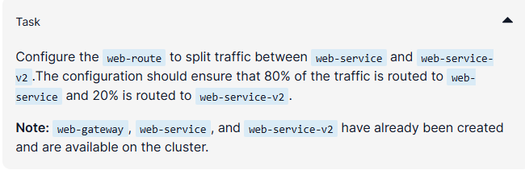
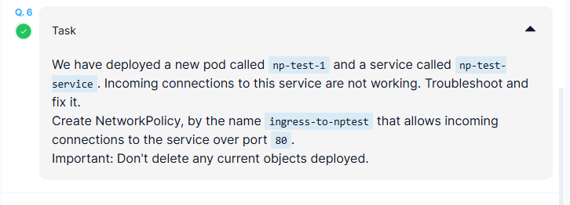

```
controlplane ~ ➜  kubectl get cm kubeadm-config -n kube-system -o yaml
apiVersion: v1
data:
  ClusterConfiguration: |
    apiServer:
      certSANs:
      - controlplane
    apiVersion: kubeadm.k8s.io/v1beta4
    caCertificateValidityPeriod: 87600h0m0s
    certificateValidityPeriod: 8760h0m0s
    certificatesDir: /etc/kubernetes/pki
    clusterName: kubernetes
    controlPlaneEndpoint: controlplane:6443
    controllerManager: {}
    dns: {}
    encryptionAlgorithm: RSA-2048
    etcd:
      local:
        dataDir: /var/lib/etcd
    imageRepository: registry.k8s.io
    kind: ClusterConfiguration
    kubernetesVersion: v1.34.0
    networking:
      dnsDomain: cluster.local
      podSubnet: 172.17.0.0/16
      serviceSubnet: 172.20.0.0/16
    proxy: {}
    scheduler: {}
kind: ConfigMap
metadata:
  creationTimestamp: "2026-01-06T08:16:13Z"
  name: kubeadm-config
  namespace: kube-system
  resourceVersion: "257"
  uid: 2c497740-4f88-4575-a294-872c1724ec31
```

### Create a Horizontal Pod Autoscaler (HPA) api-hpa for the deployment named api-deployment located in the api namespace.



```
apiVersion: autoscaling/v2
kind: HorizontalPodAutoscaler
metadata:
  name: api-hpa
  namespace: api
spec:
  maxReplicas: 20
  minReplicas: 1
  scaleTargetRef:
    apiVersion: apps/v1
    kind: Deployment
    name: api-deployment
  metrics:
    - type: Pods
      pods:
        metric:
          name: requests_per_second 
        target:
          type: AverageValue
          averageValue: 1k
status:
  currentMetrics: null
  desiredReplicas: 0
```

Reference: https://kubernetes.io/docs/tasks/run-application/horizontal-pod-autoscale-walkthrough/



---

### Create a web-route



```
controlplane ~ ➜  cat hr.yaml 
apiVersion: gateway.networking.k8s.io/v1
kind: HTTPRoute
metadata:
  name: web-route
  namespace: default
spec:
  parentRefs:
  - name: web-gateway
  rules:
  - matches:
    - path:
        type: PathPrefix
        value: /
  - backendRefs:
    - name: web-service
      port: 80
      weight: 80
    - name: web-service-v2
      port: 80
      weight: 20
```

---

### Create a Networkpolicy



```
apiVersion: networking.k8s.io/v1
kind: NetworkPolicy
metadata:
  name: ingress-to-nptest
  namespace: default
spec:
  podSelector:
    matchLabels:
      run: np-test-1
  policyTypes:
  - Ingress
  ingress:
    - ports:
      - protocol: TCP
        port: 80
```