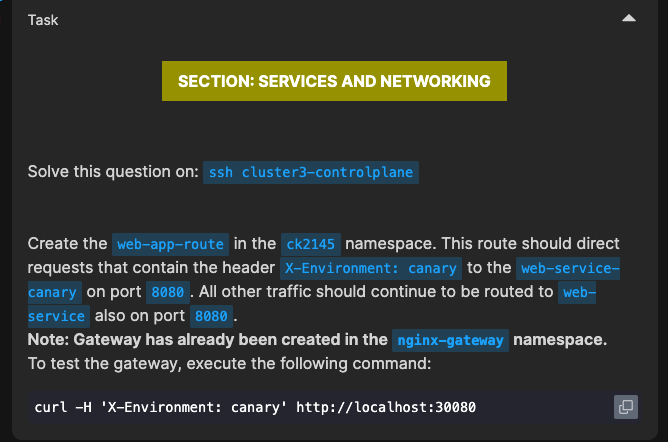
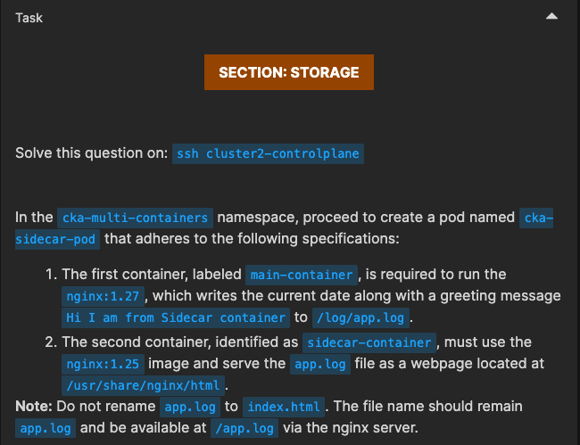
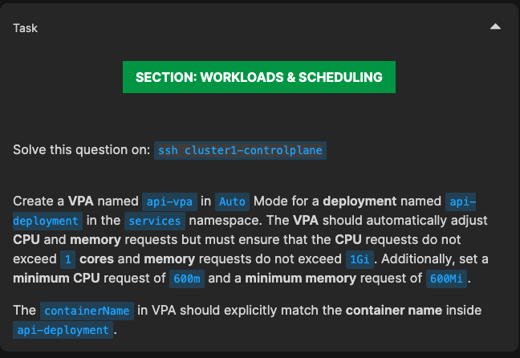
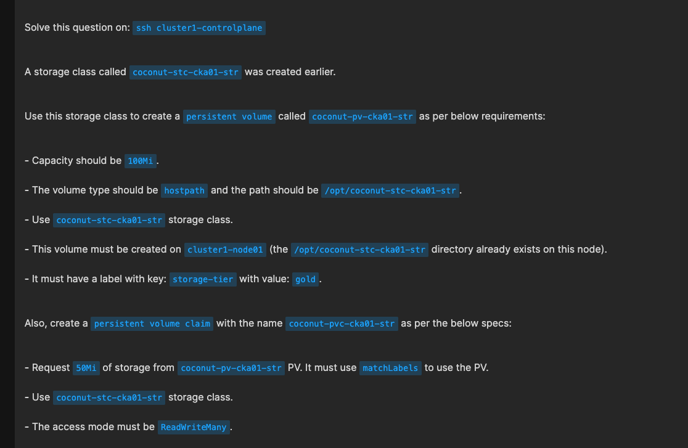
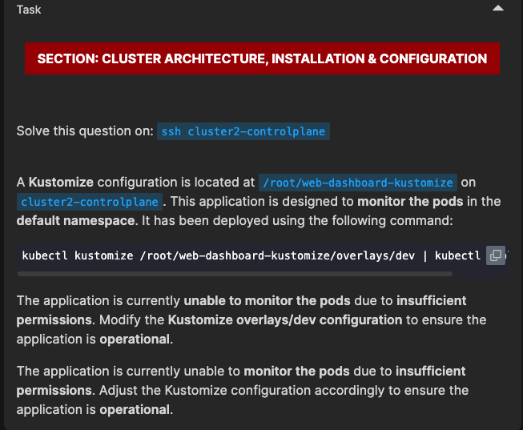

# CKA Mock Exam 5 - Questions and Solutions

---

## Question 1: HTTPRoute with Canary Deployment

### Problem Statement



Create an HTTPRoute that routes traffic based on the `X-Environment: canary` header to the canary service, otherwise routes to the main service.

### Solution

```yaml
apiVersion: gateway.networking.k8s.io/v1
kind: HTTPRoute
metadata:
  name: web-app-route
  namespace: ck2145
spec:
  parentRefs:
  - name: nginx-gateway 
    namespace: nginx-gateway
  rules:
  - matches:
    - headers:
      - name: X-Environment
        value: canary
    backendRefs:
    - name: web-service-canary
      port: 8080
  - backendRefs:
    - name: web-service
      port: 8080
```

**Key Points:**
- First rule matches requests with `X-Environment: canary` header
- Routes matching traffic to `web-service-canary`
- Default traffic (no header match) goes to `web-service`
- Order matters - specific matches before general ones

---

## Question 2: Sidecar Container Pod

### Problem Statement

**SECTION: STORAGE**



Solve this question on: `ssh cluster2-controlplane`

In the `cka-multi-containers` namespace, proceed to create a pod named `cka-sidecar-pod` that adheres to the following specifications:

1. The first container, labeled `main-container`, is required to run the `nginx:1.27`, which writes the current date along with a greeting message `Hi I am from Sidecar container` to `/log/app.log`.

2. The second container, identified as `sidecar-container`, must use the `nginx:1.25` image and serve the `app.log` file as a webpage located at `/usr/share/nginx/html`.

**Note:** Do not rename `app.log` to `index.html`. The file name should remain `app.log` and be available at `/app.log` via the nginx server.

### Solution

```yaml
apiVersion: v1
kind: Pod
metadata:
  name: cka-sidecar-pod
  namespace: cka-multi-containers
spec:
  containers:
    - name: main-container
      image: nginx:1.27
      command: ["/bin/sh"]
      args:
        - -c
        - |
          while true; do
            echo "$(date) Hi I am from Sidecar container" >> /log/app.log;
            sleep 5;
          done
      volumeMounts:
        - name: shared-logs
          mountPath: /log
    - name: sidecar-container
      image: nginx:1.25
      volumeMounts:
        - name: shared-logs
          mountPath: /usr/share/nginx/html
  volumes:
    - name: shared-logs
      emptyDir: {}
```

**Key Points:**
- Pod has 2 containers: `main-container` and `sidecar-container`
- Both containers share an `emptyDir` volume named `shared-logs`
- Main container writes logs to `/log/app.log`
- Sidecar serves logs via nginx from `/usr/share/nginx/html`
- Volume allows both containers to access the same log file

---

## Question 3: Vertical Pod Autoscaler (VPA)

### Problem Statement



Create a VPA for the `api-deployment` with specific resource limits and auto-update mode.

**⚠️ Important:** Be careful with the container name - double check by describing the deployment!

### Solution

```yaml
apiVersion: autoscaling.k8s.io/v1
kind: VerticalPodAutoscaler
metadata:
  name: api-vpa
  namespace: services
spec:
  targetRef:
    apiVersion: "apps/v1"
    kind: Deployment
    name: api-deployment
  updatePolicy:
    updateMode: "Auto"
  resourcePolicy:
    containerPolicies:
    - containerName: "api-container"
      minAllowed:
        cpu: 600m
        memory: 600Mi
      maxAllowed:
        cpu: 1
        memory: 1Gi
      controlledResources:
      - cpu
      - memory
      controlledValues: RequestsAndLimits
```

**Key Points:**
- VPA targets the `api-deployment` in the `services` namespace
- `updateMode: "Auto"` - automatically applies recommendations and restarts pods
- Container name must match exactly: `api-container` (verify with `kubectl describe deploy`)
- Minimum resources: 600m CPU, 600Mi memory
- Maximum resources: 1 CPU, 1Gi memory
- Controls both requests and limits

---

## Question 4: PersistentVolume and PersistentVolumeClaim with StorageClass

### Problem Statement



Solve this question on: `ssh cluster1-controlplane`

A storage class called `coconut-stc-cka01-str` was created earlier.

Use this storage class to create a `persistent volume` called `coconut-pv-cka01-str` as per below requirements:

- Capacity should be `100Mi`.
- The volume type should be `hostpath` and the path should be `/opt/coconut-stc-cka01-str`.
- Use `coconut-stc-cka01-str` storage class.
- This volume must be created on `cluster1-node01` (the `/opt/coconut-stc-cka01-str` directory already exists on this node).
- It must have a label with key: `storage-tier` with value: `gold`.

Also, create a `persistent volume claim` with the name `coconut-pvc-cka01-str` as per the below specs:

- Request `50Mi` of storage from `coconut-pv-cka01-str` PV. It must use `matchLabels` to use the PV.
- Use `coconut-stc-cka01-str` storage class.
- The access mode must be `ReadWriteMany`.

**⚠️ Important:** Read the question carefully - note the storage requirements and node affinity!

### Solution

**PersistentVolume:**
```yaml
apiVersion: v1
kind: PersistentVolume
metadata:
  name: coconut-pv-cka01-str
  labels: 
    storage-tier: gold
spec:
  capacity:
    storage: 100Mi
  accessModes:
    - ReadWriteMany
  hostPath:
    path: /opt/coconut-stc-cka01-str
  storageClassName: coconut-stc-cka01-str
  nodeAffinity:
    required:
      nodeSelectorTerms:
        - matchExpressions:
            - key: kubernetes.io/hostname
              operator: In
              values:
                - cluster1-node01
```

**PersistentVolumeClaim:**
```yaml
apiVersion: v1
kind: PersistentVolumeClaim
metadata:
  name: coconut-pvc-cka01-str
spec:
  accessModes:
    - ReadWriteMany
  resources:
    requests:
      storage: 50Mi
  storageClassName: coconut-stc-cka01-str
  selector: 
    matchLabels:
      storage-tier: gold
```

**Key Points:**
- PV has 100Mi capacity, PVC requests only 50Mi
- Label `storage-tier: gold` on PV matched by selector in PVC
- `ReadWriteMany` access mode allows multiple pods to mount
- Node affinity pins PV to `cluster1-node01`
- StorageClass name must match in both PV and PVC
- PVC selector ensures it binds to the correct PV

---

## Question 5: Kustomize Configuration

### Problem Statement



### Solution

*Solution depends on the specific requirements in the question above.*

---

## 📚 Kustomize Quick Reference

### What is Kustomize?
Kustomize is a Kubernetes native configuration management tool that lets you customize resource configurations without modifying the original YAML files. It's built into `kubectl` (v1.14+).

### Essential Kustomize Commands

#### 1. **Preview/Dry-run** (Most Important for Exam)
```bash
# View the final rendered YAML without applying
kubectl kustomize <directory>

# Example
kubectl kustomize ./overlays/production
kubectl kustomize .
```

#### 2. **Apply Kustomize Configuration**
```bash
# Method 1: Apply directly from directory (Recommended)
kubectl apply -k <directory>

# Example
kubectl apply -k ./overlays/production
kubectl apply -k .

# Method 2: Pipe kustomize output to kubectl apply
kubectl kustomize <directory> | kubectl apply -f -

# Example - Preview what will be applied, then apply
kubectl kustomize . | kubectl apply -f -
kubectl kustomize ./overlays/prod | kubectl apply -f -
```

**Note:** The `-f -` means "read from stdin" (the hyphen represents stdin). This method is useful when you want to see the rendered YAML first or need to save it.

#### 3. **Comparison: Two Ways to Apply**
```bash
# These are equivalent:
kubectl apply -k .                      # Direct approach (simpler)
kubectl kustomize . | kubectl apply -f - # Pipe approach (more flexible)

# Why use pipe method?
# - You can inspect output first: kubectl kustomize . | less
# - You can save to file: kubectl kustomize . | tee output.yaml | kubectl apply -f -
# - You can combine with other tools: kubectl kustomize . | yq eval '.items[].metadata.name'
```

#### 4. **Delete Resources**
```bash
kubectl delete -k <directory>

# Or using pipe
kubectl kustomize <directory> | kubectl delete -f -
```

#### 5. **Diff Before Applying**
```bash
kubectl diff -k <directory>
```

---

### Kustomize Directory Structure

```
├── base/
│   ├── deployment.yaml
│   ├── service.yaml
│   └── kustomization.yaml
└── overlays/
    ├── dev/
    │   └── kustomization.yaml
    └── prod/
        └── kustomization.yaml
```

---

### Common kustomization.yaml Patterns

#### Basic kustomization.yaml (Base)
```yaml
apiVersion: kustomize.config.k8s.io/v1beta1
kind: Kustomization

resources:
  - deployment.yaml
  - service.yaml

commonLabels:
  app: myapp
  env: base
```

#### Overlay kustomization.yaml (Production)
```yaml
apiVersion: kustomize.config.k8s.io/v1beta1
kind: Kustomization

# Reference base
bases:
  - ../../base

# OR in newer versions
resources:
  - ../../base

# Add namespace
namespace: production

# Add common labels
commonLabels:
  env: production

# Modify replicas
replicas:
  - name: myapp-deployment
    count: 5

# Add prefix/suffix to resource names
namePrefix: prod-
nameSuffix: -v2

# Patch specific resources
patchesStrategicMerge:
  - deployment-patch.yaml

# Or JSON patches
patchesJson6902:
  - target:
      group: apps
      version: v1
      kind: Deployment
      name: myapp
    patch: |-
      - op: replace
        path: /spec/replicas
        count: 3
```

---

### Key Kustomization Fields

| Field                             | Purpose                         | Example             |
| --------------------------------- | ------------------------------- | ------------------- |
| `resources`                       | List of resource files          | `- deployment.yaml` |
| `bases` (old) / `resources` (new) | Reference to base configs       | `- ../../base`      |
| `namespace`                       | Set namespace for all resources | `namespace: prod`   |
| `namePrefix`                      | Add prefix to resource names    | `namePrefix: dev-`  |
| `nameSuffix`                      | Add suffix to resource names    | `nameSuffix: -v1`   |
| `commonLabels`                    | Add labels to all resources     | `app: myapp`        |
| `commonAnnotations`               | Add annotations                 | `owner: team-a`     |
| `replicas`                        | Override replica count          | See example above   |
| `images`                          | Modify image tags               | See below           |
| `patchesStrategicMerge`           | Strategic merge patches         | List of patch files |
| `patchesJson6902`                 | JSON patch operations           | See example above   |
| `configMapGenerator`              | Generate ConfigMaps             | See below           |
| `secretGenerator`                 | Generate Secrets                | See below           |

---

### Useful Patterns for CKA Exam

#### 1. Change Image Tag
```yaml
images:
  - name: nginx
    newTag: 1.21
  - name: myapp
    newName: myregistry/myapp
    newTag: v2.0
```

#### 2. Generate ConfigMap
```yaml
configMapGenerator:
  - name: app-config
    literals:
      - DB_HOST=mysql
      - DB_PORT=3306
    files:
      - config.properties
```

#### 3. Generate Secret
```yaml
secretGenerator:
  - name: db-secret
    literals:
      - username=admin
      - password=secret123
```

#### 4. Simple Patch Example
```yaml
# deployment-patch.yaml
apiVersion: apps/v1
kind: Deployment
metadata:
  name: myapp
spec:
  replicas: 10
  template:
    spec:
      containers:
      - name: myapp
        resources:
          limits:
            memory: "1Gi"
            cpu: "500m"
```

---

### Exam Tips for Kustomize

1. **Always preview first**: Use `kubectl kustomize .` to see what will be applied
2. **Check the directory**: Make sure you're in the correct overlay directory (dev/staging/prod)
3. **Verify kustomization.yaml exists**: The file must be named exactly `kustomization.yaml`
4. **Use `-k` flag**: Remember `kubectl apply -k` NOT `-f` for kustomize directories
5. **Common mistake**: Forgetting the `.` at the end: `kubectl apply -k .`
6. **Base reference**: In overlays, bases/resources path is relative to the kustomization.yaml file
7. **Test locally**: Use `kubectl kustomize . > output.yaml` to save and review

---

### Quick Troubleshooting

```bash
# Validate kustomization syntax
kubectl kustomize . --enable-alpha-plugins

# Preview and save output to file
kubectl kustomize . > output.yaml

# Preview and apply in one command
kubectl kustomize . | kubectl apply -f -

# Preview and check for specific resources
kubectl kustomize . | grep -E "^kind:|^  name:"

# Count how many resources will be created
kubectl kustomize . | grep -c "^---"

# Apply with dry-run first
kubectl kustomize . | kubectl apply --dry-run=client -f -

# Apply and immediately watch resources
kubectl kustomize . | kubectl apply -f - && kubectl get all -n <namespace>

# Delete using pipe
kubectl kustomize . | kubectl delete -f -
```

---

