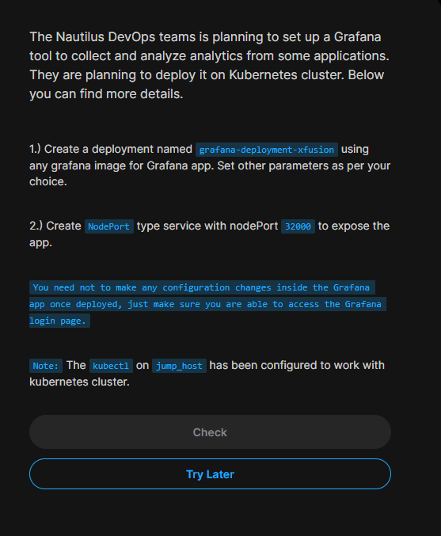

### Problem statment:



```
apiVersion: apps/v1
kind: Deployment
metadata:
  creationTimestamp: null
  labels:
    app: grafana
  name: grafana-deployment-xfusion
spec:
  replicas: 1
  selector:
    matchLabels:
      app: grafana
  strategy: {}
  template:
    metadata:
      creationTimestamp: null
      labels:
        app: grafana
    spec:
      containers:
      - image: grafana/grafana:latest
        name: grafana
        ports:
        - containerPort: 8080
        resources: {}
status: {}
---
apiVersion: v1
kind: Service
metadata:
  name: grafana-service-xfusion
spec:
  type: NodePort
  selector:
    app: grafana
  ports:
    - port: 80
      targetPort: 8080
      nodePort: 32000
```