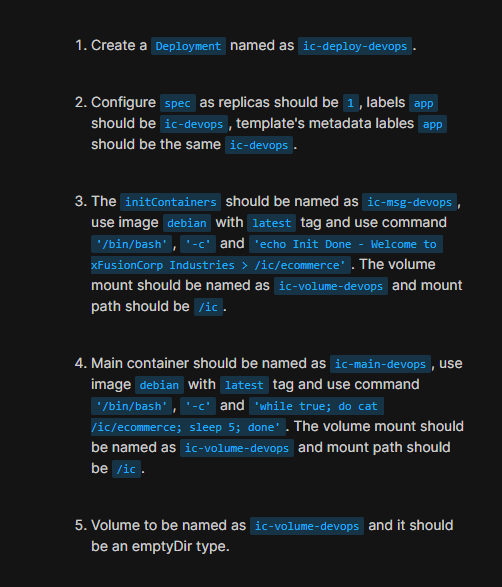

### Problem Statement



```
apiVersion: apps/v1
kind: Deployment
metadata:
  creationTimestamp: null
  labels:
    app: ic-devops
  name: ic-deploy-devops
spec:
  replicas: 1
  selector:
    matchLabels:
      app: ic-devops
  strategy: {}
  template:
    metadata:
      creationTimestamp: null
      labels:
        app: ic-devops
    spec:
      volumes:
      - name: ic-volume-devops
        emptyDir: {}
      initContainers:
      - name: ic-msg-devops
        image: debian:latest
        command: ['/bin/bash', '-c' , 'echo Init Done - Welcome to xFusionCorp Industries > /ic/official']
        volumeMounts:
        - name: ic-volume-devops
          mountPath: /ic
      containers:
      - image: debian:latest
        name: ic-main-devops
        command: ['/bin/bash', '-c', 'while true; do cat /ic/official; sleep 5; done']
        volumeMounts:
        - name: ic-volume-devops
          mountPath: /ic
        resources: {}
status: {}
```