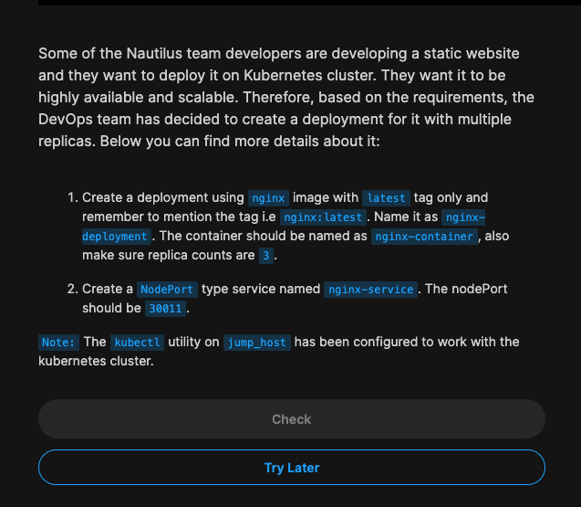

### Problem statement:



```
apiVersion: apps/v1
kind: Deployment
metadata:
  creationTimestamp: null
  labels:
    app: nginx-deployment
  name: nginx-deployment
spec:
  replicas: 3
  selector:
    matchLabels:
      app: nginx-deployment
  strategy: {}
  template:
    metadata:
      creationTimestamp: null
      labels:
        app: nginx-deployment
    spec:
      containers:
      - image: nginx:latest
        name: nginx-container
        resources: {}
status: {}
---
apiVersion: v1
kind: Service
metadata:
  name: nginx-service
spec:
  type: NodePort
  selector:
    app: nginx-deployment
  ports:
    - port: 80
      targetPort: 80
      nodePort: 30011
