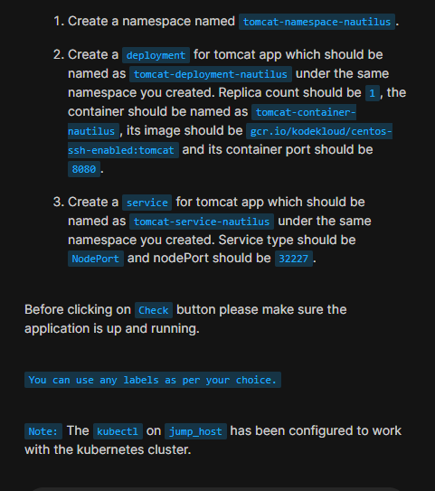

### Problem statement



```
apiVersion: v1
kind: Namespace
metadata:
  creationTimestamp: null
  name: tomcat-namespace-nautilus
spec: {}
status: {}
---
apiVersion: apps/v1
kind: Deployment
metadata:
  creationTimestamp: null
  labels:
    app: tomcat-deployment-nautilus
  name: tomcat-deployment-nautilus
  namespace: tomcat-namespace-nautilus
spec:
  replicas: 1
  selector:
    matchLabels:
      app: tomcat-deployment-nautilus
  strategy: {}
  template:
    metadata:
      creationTimestamp: null
      labels:
        app: tomcat-deployment-nautilus
    spec:
      containers:
      - image: gcr.io/kodekloud/centos-ssh-enabled:tomcat
        name: tomcat-container-nautilus
        ports:
        - containerPort: 8080
        resources: {}
status: {}
---
apiVersion: v1
kind: Service
metadata:
  name: tomcat-service-nautilus
  namespace: tomcat-namespace-nautilus
spec:
  type: NodePort
  selector:
    app: tomcat-deployment-nautilus
  ports:
    - port: 8080
      targetPort: 8080
      nodePort: 32227

```