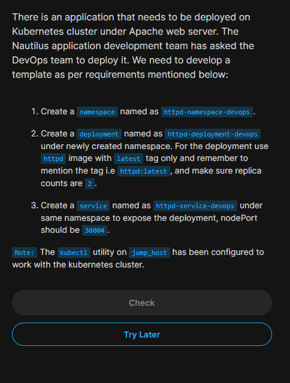

### Problem statement



```
apiVersion: v1
kind: Namespace
metadata:
  creationTimestamp: null
  name: httpd-namespace-datacenter
spec: {}
status: {}
apiVersion: v1
kind: Service
metadata:
  name: httpd-service-datacenter
  namespace: httpd-namespace-datacenter
spec:
  type: NodePort
  selector:
    app: httpd-deployment-datacenter
  ports:
    - port: 80
      targetPort: 80
      nodePort: 30004
---
apiVersion: apps/v1
kind: Deployment
metadata:
  creationTimestamp: null
  labels:
    app: httpd-deployment-datacenter
  name: httpd-deployment-datacenter
  namespace: httpd-namespace-datacenter
spec:
  replicas: 2
  selector:
    matchLabels:
      app: httpd-deployment-datacenter
  strategy: {}
  template:
    metadata:
      creationTimestamp: null
      labels:
        app: httpd-deployment-datacenter
    spec:
      containers:
      - image: httpd:latest
        name: httpd
        resources: {}
status: {}
```