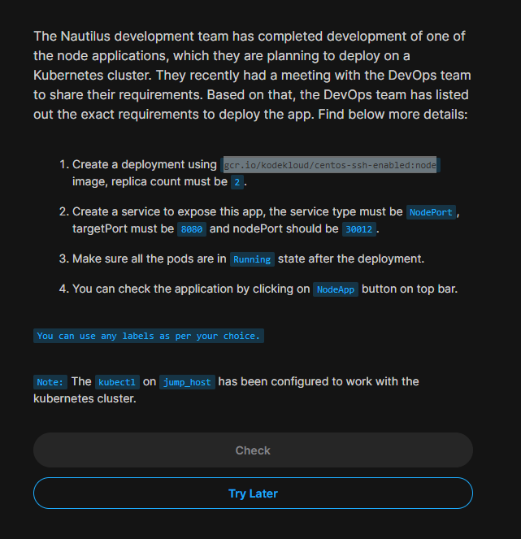

### Problem statement



```
apiVersion: apps/v1
kind: Deployment
metadata:
  creationTimestamp: null
  labels:
    app: nodeapp-deployment
  name: nodeapp-deployment
spec:
  replicas: 2
  selector:
    matchLabels:
      app: nodeapp-deployment
  strategy: {}
  template:
    metadata:
      creationTimestamp: null
      labels:
        app: nodeapp-deployment
    spec:
      containers:
      - image: gcr.io/kodekloud/centos-ssh-enabled:node
        name: nodeapp-deployment-container
        ports:
        - containerPort: 8080
        resources: {}
status: {}

---
apiVersion: v1
kind: Service
metadata:
  creationTimestamp: null
  labels:
    app: nodeapp-deployment
  name: nodeapp-service
spec:
  ports:
  - port: 8080
    protocol: TCP
    nodePort: 30012
    targetPort: 8080
  selector:
    app: nodeapp-deployment
  type: NodePort
status:
  loadBalancer: {}

```